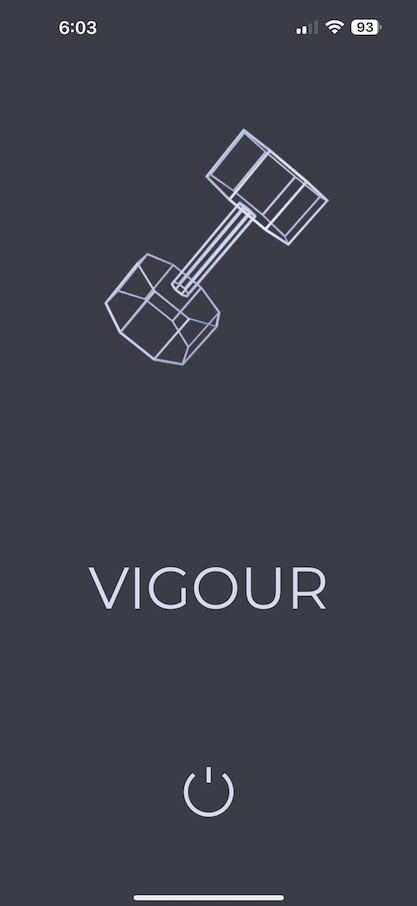
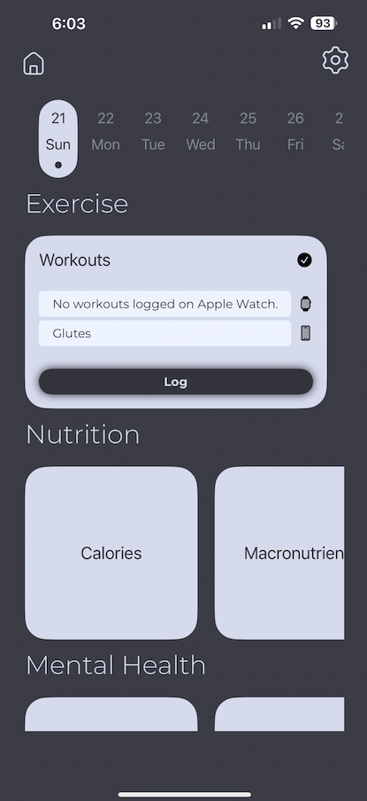
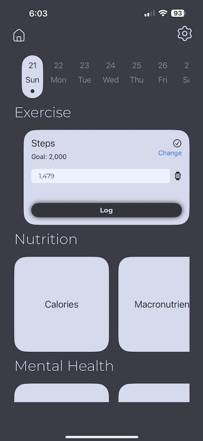
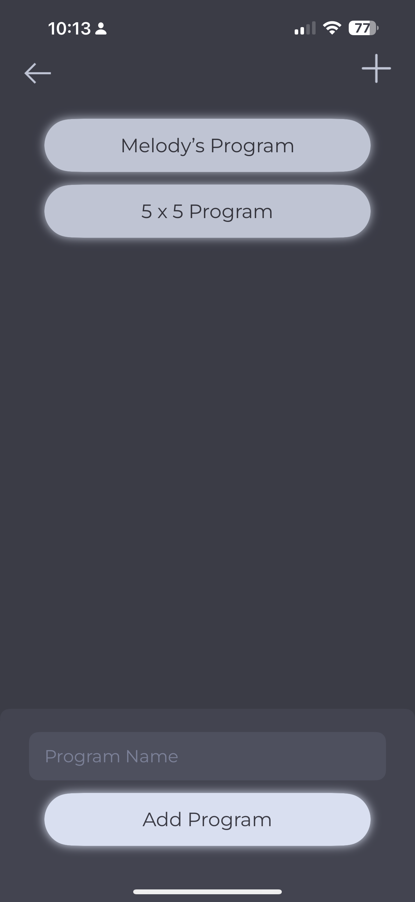
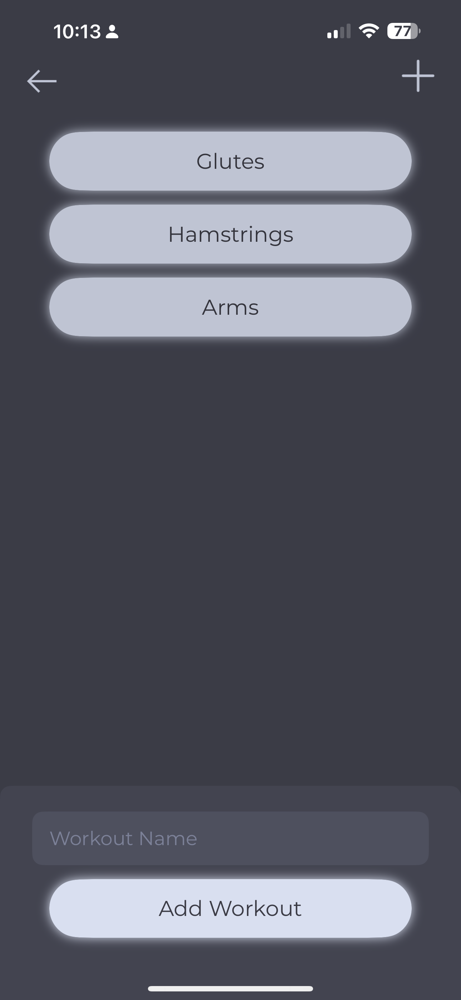
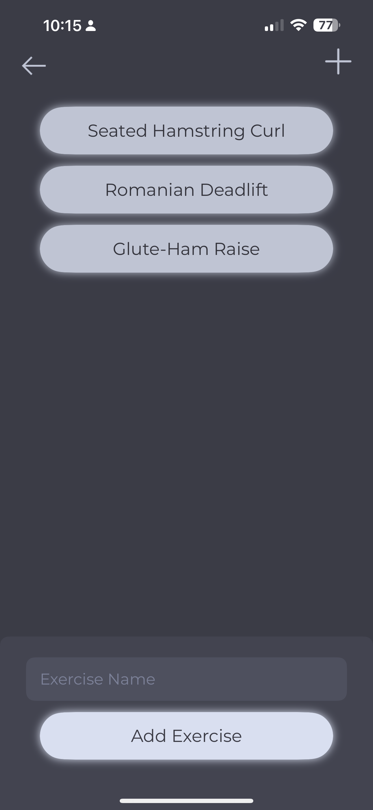
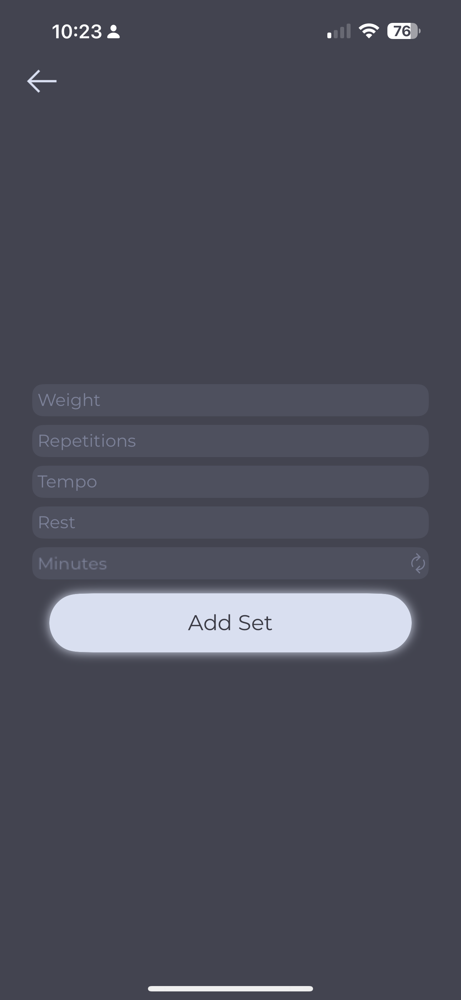
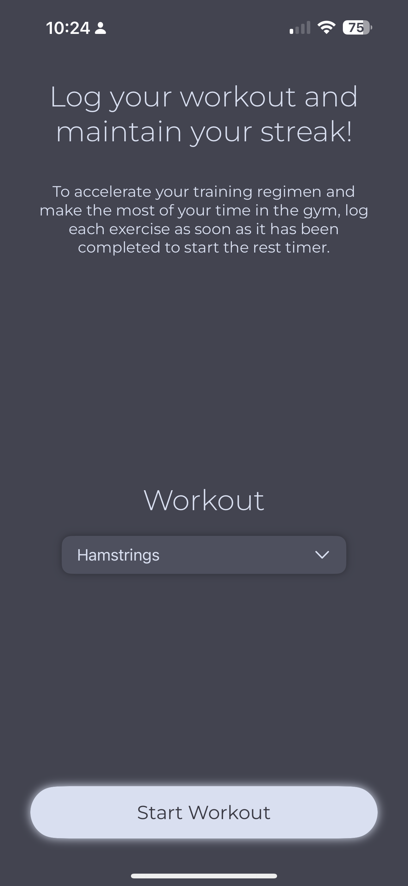
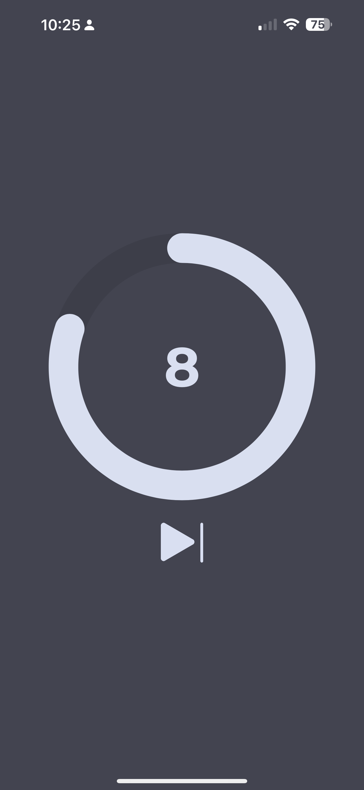

# Vigour

## Table of Contents
- [Introduction](#introduction)
- [Features](#features)
- [Screenshots](#screenshots)

## Introduction
Vigour is a fitness application designed to help users manage and track their workout routines efficiently. Users are encouraged to complete their workouts using the application's interactive workout logging feature which has a rest timer for in between exercise sets. The application utilises CoreData for persistent data storage. The application fetches workout data and step data from the user's HealthStore and integrates this in it's goal-oriented logging features. The home view features a dumbbell animation made with Blender.

## Features
- **Program Management**: Create, edit, and manage strength-training programs.
- **Workout Management**: Create, edit, and manage workouts within each strength-training program.
- **Exercise Management**: Create, edit, and manage exercises within each workout.
- **Customisability**: Add sets to exercises with customised weights, repetitions, tempo, and rest time.
- **Workout Logging**: Workouts are logged once they have been completed within the application.
- **HealthKit Integration**: Integrates with HealthKit to track daily steps and Functional Strength Training workouts.
- **Calendar**: Displays workouts and steps completed on each day of the calendar week.
- **User-Friendly and Interactive Interface**: Easy-to-use and interactive interface with smooth navigation and clean design.

- ## Screenshots
## Screenshots

  
  
  
  
  
  
  
  
  

